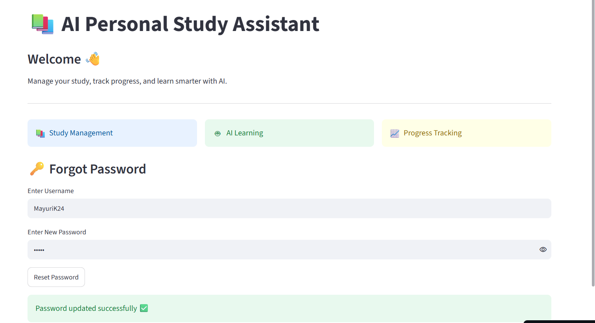
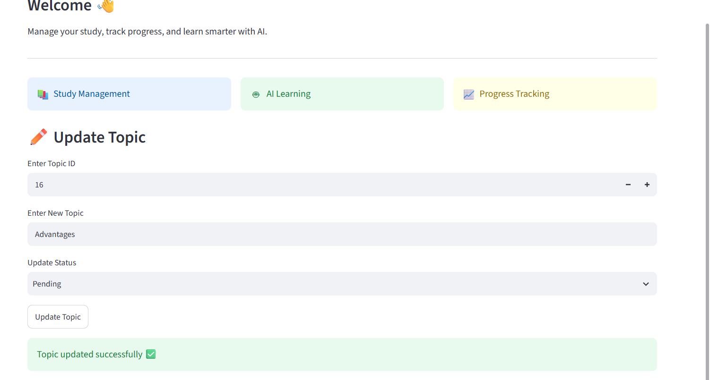

# AI-Personal-Study-Assistant
AI Personal Study Assistant is a smart learning tool developed using Python and Streamlit that helps students organize topics, monitor study progress  and get AI-powered explanations for effective learning.
# 📸 Project Screenshots

## 1. Register Page

## 2. Login Page

## 3. Dashboard

## 4. Add Topic

## 5. My Topics

## 6. Update Topic

## 7. AI Topic Explanation

## 8. AI Chat Assistant

## 09. AI Quiz Generator

## 10. Study Planner

## 11. Progress Dashboard

## 12. PDF Export

